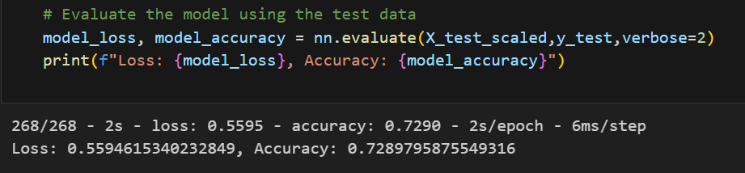
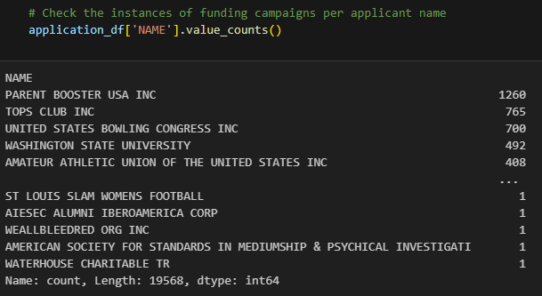

# Module 21 Deep-Learning Challenge

## Deep-Learning Challenge 
1. **Overview**  
The purpose of this analysis was to design a tool that would be able to help a nonprofit organization, in our case **Alphabet Soup** select applicants for funding with the best chance for success in their venture. More specifically a ***binary classifier neural network*** that will train itself from the data provided by the organization to predict whether applicants will be successful if funded. Using techniques such as features selection, data scaling and value binning my aim was to produce a model with a accuracy selection rate of 75% or higher. 

## Table of Contents

- [Neural Network Analysis Report](#neural-network-analysis-report)
- [Getting Started & Installing](#getting-started--installing)
- [Contributing](#contributing)

## Neural Network Analysis Report

2. **Results**
* Data Preprocessing
	*  The target variable for my model was the -   **IS_SUCCESSFUL** column —which represents if the money  was used effectively or not. 1 being successful and 0 being not successful
	* All other remaining columns were used as features for my model, except for the two listed in the next bullet point. These columns offered either categorical data on these applicants such as **USE_CASE** defining what the funding would be used for. Or numerical data such as **ASK_AMT** providing how much money was requested from the applicant. 
	* The variables that were removed from the input data were the **EIN** and **NAME** columns. The thought process there was that these columns only offered identification for the applicants and not any data towards the success of a funding round. 
* Compiling, Training, and Evaluating the Model
	*  Initially, the first version of my model had 3 total layers, 2 hidden and an output and ran for 100 epochs. First hidden layer having 80 neurons with the activation function "relu", and 43 input dimensions to represent the shape of the total feautures used.. The 2nd hidden layer the same except for 30 neurons and no input_dim, finally the output layer condensed down to just 1 neuron and the standard output activation function "sigmoid".  Producing an accuracy of 72.90%.

	* Unfortunately I was not able to reach the target model performance of 75.0% accuracy among my attempts. 
	* Overall I made several changes to attempt to increase my model performance, 6 method in total.  The details of my methods are broken down in full detail in the **Compile, Train & Evaluate Optimized Model** cell of the `AlphbetSoupCharity_Optimization.ipynb` file. My methodology to the optimization process was to increase the analyzing power of my model by first adding more layers, then more neurons, for e.g. my first attempt I brought in another "relu" activation layer with 60 neurons, this actually ending up being less accurate with an accuracy score of 72.84%.  The next two attempts I increased the neuron count significantly, first to a range between layers of 150, 100, 50 & 1 then for the 3rd attempt 300, 175, 100 & 1. The 2nd attempt with the 150-1 neuron range improved the model by 0.02% to 72.86% although the 3rd attempt with the highest neuron range of 300-1 actually brought the accuracy back down to 72.84%.  After noticing a peak in accuracy around the 76th and 90 (out of 100 total epochs) I decided for my 4th attempt to reduce the epochs to 80 to avoid potential overfitting of the model. This returned the accuracy back  to my best marker of 72.86%.  For my 5th attempt I added a fourth hidden layer with a "relu" activation and spaced the neuron range out a bit more to 300, 200, 100, 50 & 1. While leaving the epochs at 80m, seeing as that had a positive effect in the 4th method. To my surprise the 5th method's accuracy was 72.82% losing 0.04% with the new layer. Seeing what seemed to have worked in my previous optimization attempts, for my 6th I reduced the  neuron range across the layer back to 150-1. The same that my 2nd method had, which produced the best accuracy. Unfortunately again, this did not have a positive effect and brought the accuracy back down to 72.82%.

3. **Summary**  
	Overall, the model's performance did not end up meeting the target accuracy threshold of 75%. The best it could produce was actually the very first method, before any of my optimization attempts. What I would take from this is that adding complexity in terms of more neurons or layers may not be the approach for increasing accuracy. To improve the model further routes such as acquiring more data, or decreasing features with an encoder that will number the unique values in a column opposed to creating a seperate column for each value. In fact upon analyzing the **NAME** column with `value_counts()` (see output below) I see that many organizations appear more than once. Meaning that with that feature included the model would receive some potentially significant training on what a successful or unsuccessful campaign may look like. For e.g. With 1260 instances of Parent Booster USA Inc. the model would be fairly effective at predicting the potential success of a future campaign of theirs.  Another suggestion for improvement would be hyperparameter tuning with something like the `keras_tuner` to optimize for the ideal parameters in the model architecture.
	An alternate model I would suggest using would be a **Random Forest** model. After dummying the initial dataset with `pd.get_dummies()`the initial dataset was transformed into 44 columns. Randoms Forest's ability to handle noisy data and avoid overfitting would hopefully handle these potential issues.  As well it's ability to show feature scores could help decide if there are any features not worth keeping in future optimization attempts. 
	

## Getting Started & Installing
Dependencies needed for this project:
* `scikit-learn` ---> `pip install pandas`
* `pandas` ---> `pip install pandas`
* `tensorflow`
	* to handle the requirements of tensorflow and for performance optimization  it is recommended to create a separate environment specifically for it and install in that location. To create a new environment open a command prompt and run:  `
	conda create --name myenv`
	simply replace `myenv` with your desired name. 
	Afterwards `pip install tensorflow` and any other desired dependencies.

## Contributing

Justin Butler

**Aided By:**   
* class Teacher's Assistant
* Weekly Tutoring session

